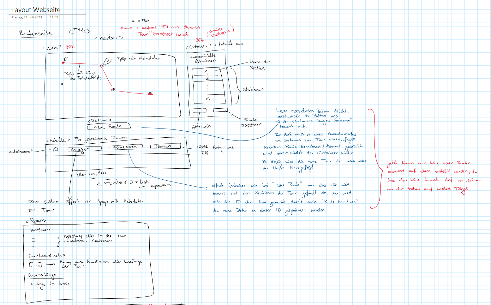
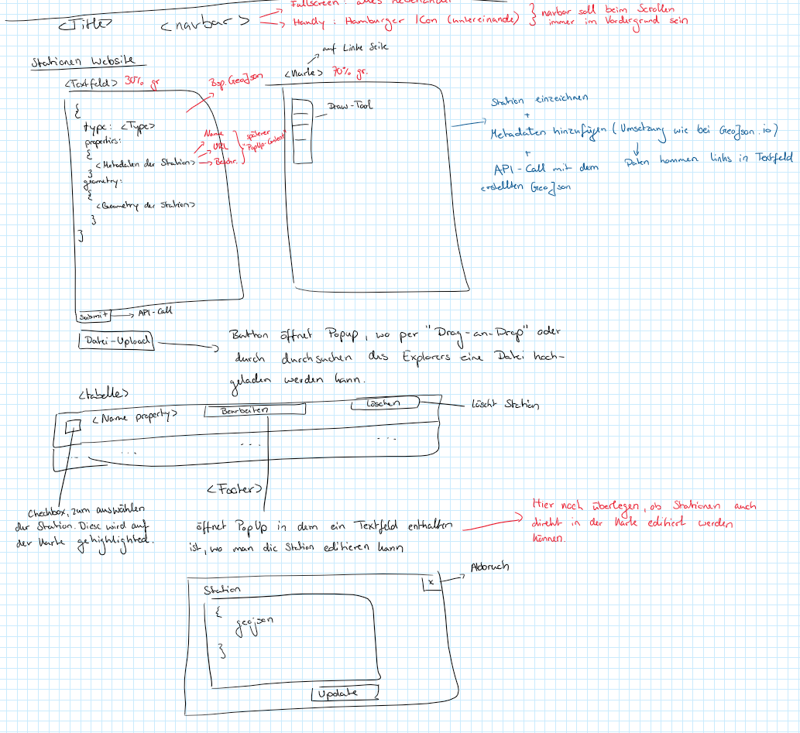

# Was ist dieses Projekt?
Dieses Projekt ist im Rahmen des Kurses "Geosoftware I" am Institut für Geoinformatik der Universität Münster im Sommersemester 2023 entstanden. Ziel des Kurses, ist es anhand eines praktischen Projektes die Entwicklung von Software, vor allem im Bereich geobasierter Webanwendungen zu erlernen. Thema des Projektes war es, eine Website zum erstellen von Radtouren zu entwickeln. Eine Radtour besteht dabei aus mindestens zwei Stationen, die durch den/die Nutzer:in auf der Website verwaltet werden können. 

> Eine **Station** ist hierbei ein Objekt mit einer Geometry, die den geografischen Standort der Station beschreibt, sowie Metadaten, die die Station näher beschreiben (Name, Beschreibung, URL mit weiteren Informationen).

> Eine **Tour** ist ebenfalls ein Objekt mit einer Geometry, die den geografischen Verlauf der Tour beschreibt ("wo verläuft die Tour"), Metadaten die die Tour näher beschreiben (Name, enthaltene Stationen, Wegbeschreibung, Gesamtlänge, Teilabschnitte der Tour) sowie einer Menge aus Stationen (mindestens 2).


## Was bietet die Website?
Die Website bietet dem/der Nutzer:in eine grafische Oberfläche für folgende Aktionen:
### Stationen
- Hinzufügen von Stationen in die Datenbank (über eine Karte, ein Textfeld oder einen Dateiupload)
- Bearbeiten dieser Stationen
- Anzeigen der Stationen auf einer Karte (mit den zu der Station gehörenden Metadaten)
- Anzeigen von Stationen in einer Liste
- Löschen der Stationen
### Touren
- Hinzufügen von Touren
- Löschen von Touren
- Anzeigen von Touren auf einer Karte (mit den zur Tour gehörenden Metadaten, sowie den Metadaten der in der Tour enthaltenen Stationen)
- Anzeigen von Touren in einer Liste (mit besonderen Informationen zur Tour)
- Bearbeiten von Touren

## Besonderheiten der Website
- **client- und serverseitige Validierung** von Anfragen an den Webserver im Bezug auf das Hinzufügen und Bearbeiten von Stationen und Touren, mit besonders detaillierten Fehlernachrichten für den/die Nutzer:in (z.B. genaue Angabe, wo in der eingegebenen GeoJSON eine Fehleingabe vorliegt)
- **Pop-Up mit erweiterten Tour-Informationen**, wie eine Wegbeschreibung und die enthaltenen Stationen
- Eine **dynamische Verwaltung der auf der Website angezeigten Elemente**, um einen Informationsüberfluss für den/die Nutzer:in zu verhindern ("es wird nur das angezeigt, was gerade benötigt wird")

# Wie starte ich den Server?
- Clone Repository
## mit Node.js
- node.js inklusive npm installieren (über offizielle Website)
- mongodb installieren (über offizielle Website)
- mit ```npm install``` alle Dependencies aus "package.json" installieren.
- mit ```npm start <GRAPHHOPPER-API-KEY>``` den Server starten.
  - einen API-Key für die Graphhopper-API bekommst du unter: [Graphhopper-API-Key](https://support.graphhopper.com/support/solutions/articles/44001976027-create-an-api-key)
  - der Server muss mit dem Graphhopper-API-Key als erstes Argument gestartet werden, ansonsten ist die Website nicht erreichbar!

## mit Docker
- [Docker Desktop](https://docs.docker.com/get-docker/) installieren.
- Docker Desktop starten
### Container noch nicht "gebaut"
- in der Command-Line mit ```$env:API_KEY="<GRAPHHOPPER-API-KEY>"``` den API Key der Graphhopper-API für den Container verfügbar machen
  - einen API-Key für die Graphhopper-API bekommst du unter: [Graphhopper-API-Key](https://support.graphhopper.com/support/solutions/articles/44001976027-create-an-api-key)
  - vor dem "bauen" des Containers muss der Graphhopper-API Key als Umgebungsvariable gesetzt werden, ansonsten ist die Website nicht erreichbar!
- mit ```docker compose up --build -d``` den Server starten
### Container bereits gebaut
- über "Docker Desktop" den Server starten


# Wie wurde dieses Projekt entwickelt?
Um auch aus einer "Software-Engineering" Perspektive möglichst viel aus diesem Projekt mitzunehmen, haben wir uns dazu entschieden folgende Entwicklungsmethoden zu verwenden. Dies kann man in unserem Repository gut nachverfolgen.
- **System-Design**: am Anfang des Projektes. Hier haben wir das Layout der Seite gemeinsam definiert und erste Software-Komponenten (.js-Dateien) festgelegt.
- **Issue-Board**: Durch das Issue Board war für uns beide immer ersichtlich, was die aktuellen Tasks im Projekt waren und wer an was arbeitet.
- **Gegenseitige Reviews**: Wir haben darauf geachtet, das Merge-Requests möglichst durch die andere person reviewed werden, um leichter Fehler zu erkennen, die man selbst übersehen hätte.
- **Testfälle**: Am Ende des Projektes haben wir pro Unterseite eine Datei mit Testfällen angelegt, um strukturiert die Funktionalität der Seite sicherzustellen.
- **Dokumentation des Repositories**: Nicht nur der Quellcode sollte gut dokumentiert sein, sondern auch der Entwicklungsprozess sollte nachvollziehbar sein. Daher haben wir z.B. "Issues" und "Commits" verknüpft und Merge-Requests enthielten eine Beschreibung der enthaltenen Features sowie Anweisungen zur Review.

Zum Abschluss sind hier noch zwei Mockups aus der "System-Design"-Phase:


